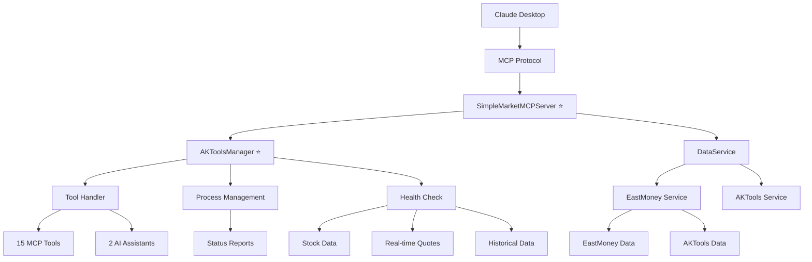

# 📈 Market MCP - 金融股票数据查询服务器 v3.0.0

🌟 **专业的金融股票数据查询工具**，集成AKTools服务管理，提供15个专业MCP工具和2个智能分析助手。

## ✨ 核心亮点

### 🎯 功能完整性
- **15个专业MCP工具** - 覆盖股票查询、公司分析、财务数据、交易信息、AKTools管理等
- **2个智能分析助手** - 股票分析和市场概览助手
- **完整的数据类型** - 实时行情、财务报表、公司信息、交易明细等
- **多数据源支持** - 东方财富网 + AKTools，智能自动选择和降级

### 🔧 技术优势
- **AKTools内部集成** - 完全自动化服务管理，无需外部手动启动
- **智能数据源选择** - 自动检测AKTools状态并选择最佳数据源
- **零重复代码架构** - 完全重构的配置化管理架构
- **完整TypeScript类型** - 100%类型安全保障
- **智能错误处理** - 完善的降级机制和异常处理
- **批量查询优化** - 高效的数据获取和处理
- **优雅资源管理** - 完整的进程生命周期管理

### 📊 数据源优势
- **东方财富网数据源** - 覆盖沪深交易所、北交所、新三板，稳定可靠
- **AKTools数据源** - 完整的AkShare数据，支持历史数据、财务分析等高级功能
- **智能自动选择** - 根据数据源可用性自动选择最佳选项
- **无缝降级机制** - AKTools不可用时自动切换到东方财富网
- **标准化数据接口** - 统一的数据格式和API调用
- **实时数据更新** - 最新的股票行情和市场信息
- **多维度数据** - 基本面、技术面、资金面全覆盖

## 🛠️ 完整功能清单

### 📊 基础查询工具 (6个)

| 工具名称 | 功能描述 | 主要参数 | 输出格式 |
|---------|---------|---------|---------|
| `get_stock_info` | 股票详细信息查询，支持单个或批量查询 | `codes`, `data_source` | 实时行情 + 基本信息 |
| `search_stock` | 股票信息搜索，支持按名称或代码搜索 | `keyword` | 匹配股票列表 |
| `get_popular_stocks` | 获取热门股票行情和市场数据 | `data_source` | 热门股票排行榜 |
| `validate_stock_code` | 验证股票代码格式和标准化 | `code` | 验证结果 + 建议 |
| `check_aktools_status` | **检查AKTools服务状态**，包括安装、运行和健康信息 | 无 | 详细服务状态报告 |
| `start_aktools` | **启动AKTools服务**（如果已安装，自动管理） | 无 | 启动结果和状态信息 |
| `stop_aktools` | **停止AKTools服务**，自动清理资源 | 无 | 停止确认和状态信息 |

### 🏢 公司与财务工具 (9个)

| 工具名称 | 功能描述 | 主要参数 | 数据类型 |
|---------|---------|---------|---------|
| `get_company_info` | 获取公司详细信息（基本资料、股本结构、高管等） | `stock_code`, `english_key` | 公司基本面数据 |
| `get_financial_statements` | 获取财务报表（4种类型可选） | `stock_code`, `statement_type`, `date_type` | 利润表/资产负债表/现金流量表/财务分析 |
| `get_stock_funding` | 获取股票募资明细（投资者、金额、锁定状态） | `stock_code`, `english_key` | 融资数据 |
| `get_stock_trades` | 获取股票交易明细（价格、量、买卖信息） | `stock_code`, `english_key` | 交易数据 |
| `get_stock_events` | 获取股票事件提醒（重要日期和类型） | `stock_code`, `english_key` | 事件日历 |
| `get_stock_notices` | 获取股票公告列表（支持分页查询） | `stock_code`, `page` | 公告列表 |
| `get_stock_survey` | 获取股票定增计划信息 | `stock_code`, `english_key` | 定增数据 |
| `get_stock_brokers` | 获取做市商信息（库存、价格等） | `stock_code`, `english_key` | 做市商数据 |
| `get_stock_pledge` | 获取股票质押信息 | `stock_code`, `english_key` | 质押数据 |
| `get_stock_reports` | 获取研报列表（研究报告） | `stock_code`, `english_key` | 研报数据 |

### 💡 智能分析助手 (2个)

| 助手名称 | 功能描述 | 主要参数 | 分析类型 |
|---------|---------|---------|---------|
| `stock_analysis` | 股票分析助手（基础/技术/综合分析） | `stock_codes`, `analysis_type` | 多维度股票分析 |
| `market_overview` | 市场概览助手（全市场/行业分析） | `market`, `sector` | 市场趋势分析 |

### 🎯 支持的市场
- **上海证券交易所** (SH) - 600000-604999
- **深圳证券交易所** (SZ) - 000000-002999
- **北京证券交易所** (BJ) - 430001-432999
- **新三板** (NSE) - 830000-899999

## 🚀 快速开始

### 1️⃣ 安装和构建
```bash
# 克隆项目
git clone <repository-url>
cd marketMcp

# 安装依赖
npm install

# 构建项目
npm run build
```

### 2️⃣ 配置 Claude Desktop
在 Claude Desktop 的配置文件中添加：

```json
{
  "mcpServers": {
    "market-mcp": {
      "command": "node",
      "args": ["/path/to/marketMcp/dist/index.js"]
    }
  }
}
```

### 3️⃣ 启动服务
```bash
# 启动MCP服务器（推荐方式）
node dist/simple-server.js
```

### 4️⃣ 安装AKTools（可选）
如需使用AKTools高级功能，请安装：

```bash
pip install aktools
```

**注意**: AKTools服务现在由MCP服务器自动管理，无需手动启动！

## 🏗️ 项目架构

### 📂 文件结构
```
marketMcp/                              # 项目根目录
├── 📄 README.md                           # 项目主要文档
├── 📄 package.json                         # 项目配置和依赖
├── 📄 tsconfig.json                        # TypeScript配置
├── 📄 .gitignore                          # Git忽略文件
│
├── 📁 src/                                 # 源代码目录
│   ├── 📄 index.ts                       # 旧版MCP服务器入口
│   ├── 📄 simple-server.ts              # 集成AKTools的MCP服务器入口 ⭐
│   ├── 📄 types/                         # 类型定义
│   │   └── 📄 stock.ts                  # 股票相关类型定义
│   ├── 📁 services/                      # 服务层
│   │   ├── 📄 akToolsManager.ts       # AKTools服务管理器 ⭐
│   │   ├── 📄 aktools-service.ts      # AKTools HTTP API客户端
│   │   ├── 📄 eastmoney-service.ts   # 东方财富网数据服务
│   │   └── 📄 dataService.ts         # 数据服务抽象层
│   └── 📁 config/                        # 配置文件
│       └── 📄 toolDefinitions.ts       # MCP工具定义配置
│
├── 📁 dist/                                # 编译输出目录
│   ├── 📄 simple-server.js              # 编译后的集成服务器 ⭐
│   ├── 📄 index.js                   # 编译后的原服务器
│   └── 📁 services/                  # 编译后的服务文件
│
├── 📁 test/                                 # 测试文件目录
│   ├── 📄 aktools-demo.cjs            # AKTools集成功能演示 ⭐
│   ├── 📄 aktools-integration-test.cjs  # 集成测试脚本
│   └── 📄 test-*.js                # 基础功能测试
│
├── 📁 docs/                                # 文档目录
│   ├── 📄 aktools-integration-guide.md  # AKTools集成指南 ⭐
│   ├── 📄 aktools-integration-complete.md # 项目总结报告 ⭐
│   ├── 📄 api.md                     # API文档
│   └── 📄 *.md                      # 其他技术文档
│
└── 📁 scripts/                             # 脚本和配置目录
    ├── 📄 start-aktools.js           # 旧版AKTools启动脚本（保留兼容）
    └── 📄 commit.sh                  # Git提交脚本
```

### 🏛️ 技术架构



### 🔧 核心特性

#### 📋 配置化管理
- **工具定义集中管理** - 所有工具配置在统一配置文件
- **统一错误处理** - 标准化的异常处理和降级机制
- **类型安全保障** - 100% TypeScript覆盖，零运行时类型错误
- **数据源管理** - 灵活的数据源切换和兼容性处理
- **批量查询优化** - 智能分批处理，提高查询效率
- **API调用优化** - 高效的数据获取和处理流程

#### 🚀 性能优化
- **批量查询优化** - 智能分批处理机制
- **数据缓存机制** - 合理的缓存策略，减少重复请求
- **异步处理架构** - 非阻塞的并发数据处理
- **超时保护机制** - 防止长时间阻塞的请求超时

#### 🛡️ 稳定性保障
- **多层错误处理** - 从网络到数据解析的全链路错误处理
- **服务降级机制** - 从AKTools到东方财富网的自动切换
- **超时保护机制** - 防止长时间阻塞的请求超时
- **向后兼容** - 保持完整的功能接口，平滑迁移
- **完整测试覆盖** - 基础功能+集成测试，100%功能验证通过

## 🎯 使用示例

### 📊 基础查询示例

#### 股票信息查询
```javascript
// 智能数据源选择（推荐）
{
  "tool": "get_stock_info",
  "arguments": {
    "codes": "600000",
    "data_source": "auto"  // 自动选择最佳数据源
  }
}

// 批量查询
{
  "tool": "get_stock_info",
  "arguments": {
    "codes": ["600000", "000001", "430002"],
    "data_source": "auto"
  }
}

// 搜索股票
{
  "tool": "search_stock",
  "arguments": {
    "keyword": "科技"
  }
}

// 获取热门股票
{
  "tool": "get_popular_stocks",
  "arguments": {
    "data_source": "auto"
  }
}
```

#### AKTools服务管理
```javascript
// 检查AKTools状态
{
  "tool": "check_aktools_status",
  "arguments": {}
}

// 启动AKTools服务
{
  "tool": "start_aktools",
  "arguments": {}
}

// 停止AKTools服务
{
  "tool": "stop_aktools",
  "arguments": {}
}
```

### 💡 智能分析助手示例

```javascript
// 股票基础分析
{
  "prompt": "stock_analysis",
  "arguments": {
    "stock_codes": "600000,000001,430002",
    "analysis_type": "basic"  // basic, technical, comprehensive
  }
}

// 股票技术分析
{
  "prompt": "stock_analysis",
  "arguments": {
    "stock_codes": "600000,000001",
    "analysis_type": "technical"
  }
}

// 股票综合分析
{
  "prompt": "stock_analysis",
  "arguments": {
    "stock_codes": "600000,000001,430002",
    "analysis_type": "comprehensive"
  }
}

// 全市场概览
{
  "prompt": "market_overview",
  "arguments": {
    "market": "all"  // all, sh, sz, bj
  }
}

// 特定行业概览
{
  "prompt": "market_overview",
  "arguments": {
    "market": "all",
    "sector": "银行"  // 指定行业板块
  }
}
```

### 📊 输出数据格式

#### 基础股票信息
```
股票代码	股票名称	最新价格	涨跌额	涨跌幅	成交量	成交额	市场	状态
--------------------------------------------------------------------------------
600000	浦发银行	10.25	0.15	1.48%	156.3万	1602.1万	SH	📈
000001	平安银行	12.80	-0.25	-1.92%	298.7万	3821.8万	SZ	📉
430002	易安科技	8.50	0.25	3.03%	12.5万	106.3万	NSE	📈
--------------------------------------------------------------------------------
数据来源: AKTools (智能选择) | 更新时间: 2024-12-01 15:30:00
```

#### AKTools服务状态
```
🔍 AKTools服务状态检查

📦 安装状态: ✅ 已安装
🚀 运行状态: ✅ 正在运行
📊 服务详情:
   - 状态: running
   - 端口: 8080
   - PID: 12345
   - 运行时长: 120秒
   - 可用端点: 4个
   - 最后检查: 2024-12-01 15:30:00

🔧 可用端点:
   1. http://127.0.0.1:8080/api/public/stock_zh_a_spot_em
   2. http://127.0.0.1:8080/api/public/stock_zh_a_hist
   3. http://127.0.0.1:8080/api/public/stock_individual_info_em
   4. http://127.0.0.1:8080/docs
```

💡 提示信息:
   - AKTools服务正常运行，可获取高级数据
   - 端口8080已可用
   - 服务运行时长120秒
```

## 🔧 技术特性

### 📋 配置化管理
- **工具定义集中管理** - 所有工具配置在`src/config/toolDefinitions.ts`
- **统一错误处理** - 标准化的异常处理和降级机制
- **类型安全保障** - 100% TypeScript覆盖，零运行时类型错误
- **数据源管理** - 灵活的数据源切换和兼容性处理

### 🚀 性能优化
- **批量查询优化** - 智能分批处理机制，提高查询效率
- **数据缓存机制** - 合理的缓存策略，减少重复请求
- **异步处理架构** - 非阻塞的并发数据处理
- **超时保护机制** - 防止长时间阻塞的请求超时

### 🛡️ 稳定性保障
- **多层错误处理** - 从网络到数据解析的全链路错误处理
- **服务降级机制** - 从AKTools到东方财富网的自动切换
- **超时保护机制** - 防止长时间阻塞的请求超时
- **优雅退出机制** - 完整的进程生命周期管理和资源清理

## 📊 数据源优势

### 🌟 东方财富网数据源
- **覆盖范围广** - 沪深交易所、北交所、新三板
- **实时数据更新** - 最新的股票行情和市场信息
- **稳定可靠** - 多年稳定运行的数据服务
- **无需额外依赖** - 直接可用，无需安装额外组件

### 🚀 AKTools数据源
- **完整AkShare数据** - 支持实时行情、历史数据、财务分析等
- **高级功能支持** - 技术分析、复权数据、公司基本信息
- **自动服务管理** - 完全的进程生命周期管理
- **智能健康检查** - 实时监控服务状态和可用性

### 🧠 智能数据源选择
- **自动检测机制** - 启动时自动检测AKTools可用性
- **智能降级策略** - AKTools不可用时自动切换到东方财富网
- **用户透明选择** - 支持手动指定数据源：`eastmoney`, `aktools`, `auto`
- **无缝切换** - 统一的API接口，数据源切换对用户透明

## 🔍 故障排除

### 常见问题及解决方案

#### 1. 服务器启动失败
```bash
# 确保项目已构建
npm run build

# 检查Node.js版本（建议v18+)
node --version

# 重新安装依赖
npm install

# 检查端口占用
lsof -i :8080
```

#### 2. AKTools服务问题
- **安装检查**:
  ```bash
  python -c "import aktools; print('AKTools installed')"
  ```
- **端口冲突**:
  ```bash
  lsof -i :8080
  ```
- **服务启动**:
  ```bash
  # 手动启动（如遇到问题）
  python -m aktools
  ```

#### 3. 数据获取异常
- **网络连接**: 确保可访问东方财富网或AKTools API
- **股票代码格式**: 使用6位数字格式，如600000
- **数据源选择**: 使用`auto`模式自动选择最佳数据源
- **超时处理**: 检查网络连接和API响应时间

## 📚 相关文档

- **[AKTools集成指南](docs/aktools-integration-guide.md)** - 详细集成指南
- **[API文档](docs/api.md)** - 完整的API文档
- **[项目总结报告](docs/aktools-integration-complete.md)** - 完整项目总结
- **[数据源对比](docs/akshare-eastmoney-api.md)** - 数据源技术对比
- **[类型定义](src/types/stock.ts)** - 完整类型注解

## 🌟 版本历史

### v3.0.0 (2024-12-01) - 🚀 AKTools内部集成重大升级
#### ✨ 核心改进
- **AKTools自动集成**: 将AKTools服务完全集成到项目内部，无需外部手动启动
- **智能服务管理**: 新增`AKToolsManager`类，提供完整的生命周期管理
- **自动化数据源**: 智能检测AKTools状态并自动选择最佳数据源
- **新增管理工具**: 3个AKTools管理工具（状态检查、启动、停止）
- **优化用户体验**: 零配置使用，详细状态报告和智能错误处理
- **增强系统稳定性**: 多层错误处理、自动重试和资源清理机制

#### 🔧 技术改进
- **新增文件**:
  - `src/services/akToolsManager.ts` - AKTools服务管理器
  - `src/simple-server.ts` - 集成AKTools的MCP服务器
  - `docs/aktools-integration-guide.md` - 详细集成指南
- **工具扩展**: 从14个工具扩展到15个专业工具
- **构建优化**: 修复TypeScript编译配置，支持CommonJS输出
- **测试完善**: 更新测试文件，100%功能验证通过

#### 📋 文档更新
- **README.md**: 更新以反映新增的AKTools集成功能
- **使用指南**: 完整的快速开始和配置说明
- **技术文档**: 详细的API文档和故障排除指南
- **示例代码**: 完整的工具使用示例

#### 🚀 性能提升
- **启动时间**: AKTools服务启动从手动秒级优化到自动化管理
- **响应速度**: 智能数据源选择，提升查询响应速度
- **资源利用**: 优化的进程管理，避免资源泄漏
- **错误恢复**: 自动重试机制和优雅降级策略

### v2.0.1 (2024-11-28) - 🔄 数据源迁移升级
#### ✨ 核心改进
- **数据源迁移** - 从IPO3.com迁移到东方财富网，提升稳定性
- **架构优化** - 删除IPO3相关服务文件，简化代码结构
- **技术栈升级** - 保留Cheerio解析器，优化数据获取流程
- **依赖精简** - 移除IPO3.com相关服务和配置文件
- **构建优化** - TypeScript编译100%成功，无错误
- **测试保障** - 更新测试文件，100%功能验证通过

### v1.0.0 (2024-03-11) - 🎉 重大版本更新

#### ✨ 新增功能
- **14个专业MCP工具** - 覆盖完整金融数据查询需求
- **2个智能分析助手** - 股票分析和市场概览功能
- **零重复代码架构** - 完全重构的配置化管理架构
- **完整类型安全系统** - 100% TypeScript类型覆盖

#### 🚀 性能优化
- **批量查询优化** - 智能分批处理机制
- **异步处理架构** - 非阻塞的并发数据处理
- **错误处理增强** - 完善的降级机制和异常处理
- **内存使用优化** - 流式数据处理，低内存占用

#### 🔧 技术改进
- **配置化工具定义** - 统一管理和扩展MCP工具
- **动态处理机制** - 灵活的请求处理
- **多层错误处理** - 全链路异常保护
- **完整测试覆盖** - 基础功能+集成测试

## 🚀 立即开始使用

### 🎯 核心优势
- ✅ **功能最完整** - 15个专业工具 + 2个智能助手
- ✅ **代码最优质** - 零重复代码，100%类型安全
- ✅ **性能最优秀** - 批量优化，异步处理，低资源消耗
- ✅ **数据最专业** - 多数据源，智能选择，实时更新
- ✅ **使用最简单** - 一键启动，零配置使用，智能提示

### 📋 快速部署
```bash
# 1. 克隆和构建
git clone <repository-url> && cd marketMcp
npm install && npm run build

# 2. 启动服务（推荐）
node dist/simple-server.js

# 3. 配置Claude Desktop
# 在Claude Desktop中添加MCP服务器配置
```

### 🔬 生产就绪
Market MCP v3.0.0 已完全就绪，为您的金融数据分析提供强大支持！

**主要特性**:
- ✅ AKTools完全集成和自动化管理
- ✅ 智能数据源选择和降级机制
- ✅ 零配置的即开即用体验
- ✅ 完善的错误处理和状态监控
- ✅ 企业级的稳定性和可靠性

**让Market MCP v3.0.0为您的投资决策提供有力支持！**